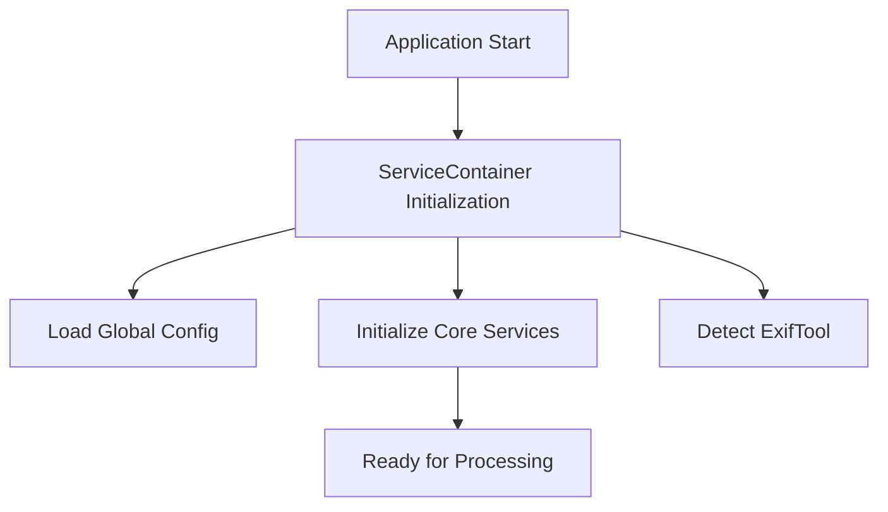
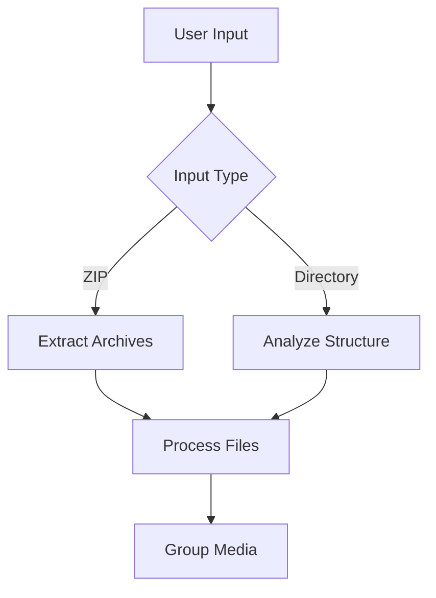
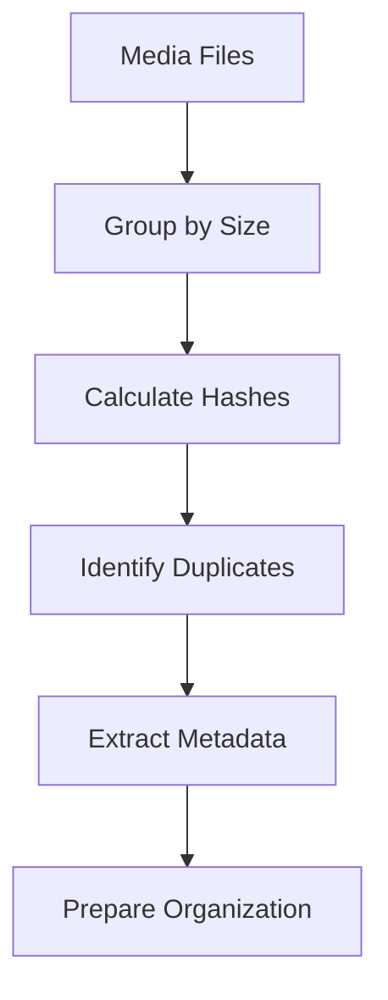
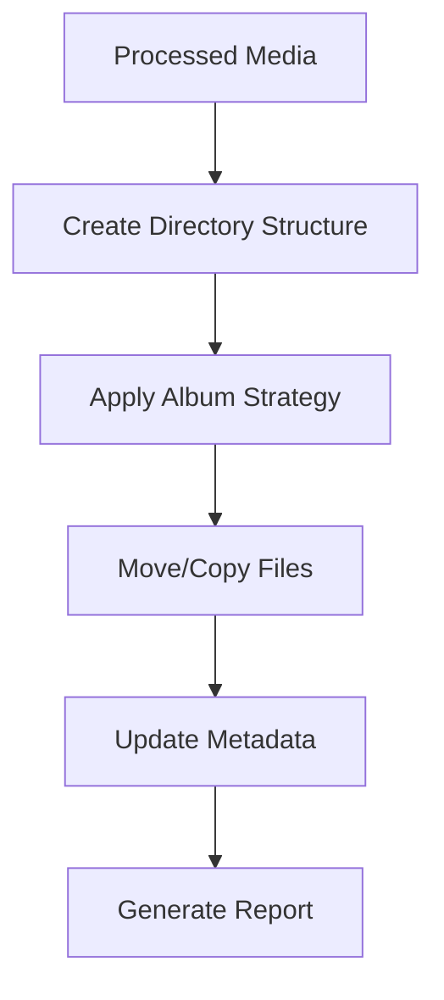

# Google Photos Takeout Helper - Technical Documentation

## Table of Contents
1. [Project Overview](#project-overview)
2. [Architecture](#architecture)
3. [Core Components](#core-components)
4. [Data Flow](#data-flow)
5. [Service Details](#service-details)
6. [Performance Considerations](#performance-considerations)
7. [Security Considerations](#security-considerations)

## Project Overview

The Google Photos Takeout Helper is a Dart application designed to process and organize Google Photos takeout exports. It provides functionality to extract, organize, and deduplicate photos and videos from Google Photos takeout archives.

### Key Features
- ZIP file extraction and processing
- Duplicate detection and handling
- Date-based organization
- Album structure preservation
- Metadata management
- Cross-platform support

## Architecture

The application follows a clean architecture pattern with clear separation of concerns:

```
lib/
├── domain/           # Business logic and entities
│   ├── entities/     # Core business objects
│   ├── models/       # Data models
│   └── services/     # Business services
├── infrastructure/   # External services and implementations
├── presentation/     # User interface and interaction
└── shared/          # Shared utilities and extensions
```

### Architecture Layers

1. **Domain Layer**
   - Contains business logic and rules
   - Defines core entities and interfaces
   - Independent of external frameworks

2. **Infrastructure Layer**
   - Implements external service integrations
   - Handles file system operations
   - Manages external tool interactions

3. **Presentation Layer**
   - Handles user interaction
   - Provides progress feedback
   - Manages configuration input

## Core Components

### Service Container
The `ServiceContainer` is the central dependency injection container that manages all application services:

```dart
class ServiceContainer {
  late final GlobalConfigService globalConfig;
  late final ConsolidatedUtilityService utilityService;
  late final ConsolidatedDiskSpaceService diskSpaceService;
  late final ConsolidatedInteractiveService interactiveService;
  ExifToolService? exifTool;
  // ...
}
```

### Configuration Management
The `GlobalConfigService` manages application-wide configuration:

```dart
class GlobalConfigService {
  bool isVerbose = false;
  bool enforceMaxFileSize = false;
  bool exifToolInstalled = false;
  // ...
}
```

## Data Flow

### 1. Initialization Phase


### 2. Input Processing


### 3. Media Processing


### 4. Organization Phase


## Service Details

### Media Processing Services

#### MediaEntityMovingService
- Coordinates file movement operations
- Implements strategy pattern for different album behaviors
- Handles concurrent file operations

```dart
class MediaEntityMovingService {
  Future<Stream<int>> moveMediaEntities(
    MediaEntityCollection entityCollection,
    MovingContext context,
  ) async* {
    // Implementation
  }
}
```

#### MediaGroupingService
- Groups media by content similarity
- Uses parallel processing
- Implements efficient duplicate detection

```dart
class MediaGroupingService {
  Future<Map<String, List<MediaEntity>>> groupByContent(
    List<MediaEntity> mediaList,
  ) async {
    // Implementation
  }
}
```

### File System Services

#### FileOperationService
- High-performance file operations
- Streaming support for large files
- Concurrency control

```dart
class FileOperationService {
  Future<File> moveOrCopyFile(
    File sourceFile,
    Directory targetDirectory, {
    required bool copyMode,
  }) async {
    // Implementation
  }
}
```

#### PathGeneratorService
- Generates target paths
- Creates date-based structures
- Handles album paths

```dart
class PathGeneratorService {
  Directory generateTargetDirectory(
    String? albumKey,
    DateTime? dateTaken,
    MovingContext context,
  ) {
    // Implementation
  }
}
```

## Performance Considerations

### 1. Memory Management
- Streaming for large files
- Chunked processing
- Memory-efficient data structures

### 2. Concurrency
- Parallel processing with limits
- Resource-aware scheduling
- Thread pool management

### 3. I/O Optimization
- Buffered operations
- Batch processing
- Efficient file system access

## Security Considerations

### 1. File System Security
- Path traversal prevention
- Permission validation
- Safe file operations

### 2. Data Integrity
- Hash verification
- Checksum validation
- Error recovery

### 3. Resource Management
- Disk space monitoring
- Memory usage limits
- Process isolation

## Error Handling

The application implements comprehensive error handling:

1. **File System Errors**
   - Permission issues
   - Disk space problems
   - File access conflicts

2. **Processing Errors**
   - Corrupt files
   - Invalid metadata
   - Duplicate conflicts

3. **User Input Errors**
   - Invalid paths
   - Configuration issues
   - Permission problems

## Testing

The project includes comprehensive testing:

1. **Unit Tests**
   - Service functionality
   - Business logic
   - Utility functions

2. **Integration Tests**
   - Service interactions
   - File system operations
   - End-to-end workflows

3. **Performance Tests**
   - Large file handling
   - Concurrent operations
   - Memory usage

## Future Considerations

1. **Scalability**
   - Distributed processing
   - Cloud integration
   - Batch processing

2. **Features**
   - Additional metadata support
   - Enhanced duplicate detection
   - Advanced organization options

3. **Performance**
   - GPU acceleration
   - Improved concurrency
   - Better memory management 